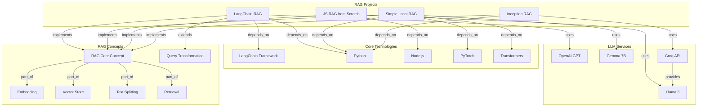
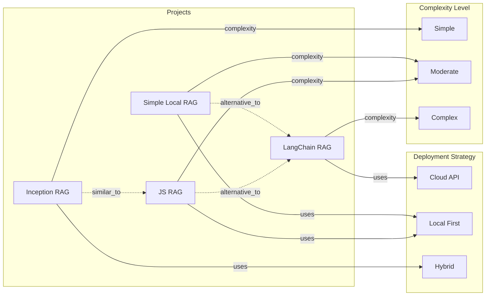
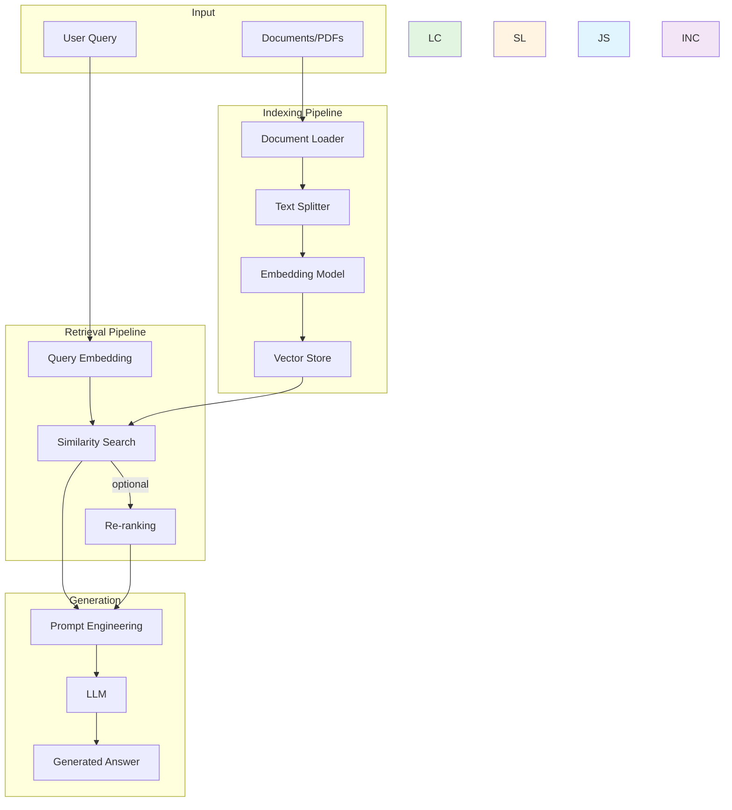

# RAG 系统知识图谱

> 生成时间: 2026-03-18
> 主题: 检索增强生成 (Retrieval Augmented Generation) 教程项目

## 1. 核心实体

### 1.1 项目

| 实体 | 类型 | 描述 | 核心特征 |
|------|------|------|----------|
| **LangChain RAG** | Project | LangChain 官方 RAG 教程 | 最全面、云端 API、视频教程 |
| **Simple Local RAG** | Project | 本地运行的 RAG 教程 | 隐私优先、GPU 依赖、开源模型 |
| **RAG from Scratch (JS)** | Project | JavaScript 实现的 RAG | Node.js、模块化、本地 LLM |
| **Inception RAG** | Project | 极简 Python RAG 实现 | 无框架、最简代码、适合入门 |

### 1.2 核心技术

| 实体 | 类型 | 描述 | 相关项目 |
|------|------|------|----------|
| **LangChain** | Framework | Python RAG/LLM 框架 | LangChain RAG |
| **Transformers** | Library | Hugging Face ML 库 | Simple Local RAG |
| **Node.js** | Runtime | JavaScript 运行时 | JS Version |
| **PyTorch** | Framework | 深度学习框架 | Simple Local RAG |
| **llama.cpp** | Library | C++ LLM 推理库 | JS Version |

### 1.3 LLM 服务

| 实体 | 类型 | 描述 | 使用项目 |
|------|------|------|----------|
| **OpenAI GPT** | LLM API | 商业 LLM API | LangChain RAG |
| **Gemma 7B** | Open Model | Google 开源模型 | Simple Local RAG |
| **Llama 3** | Open Model | Meta 开源模型 | Inception RAG |
| **Groq** | Inference API | 高速推理平台 | Inception RAG |

### 1.4 核心概念

| 概念 | 定义 | 相关技术 |
|------|------|----------|
| **RAG** | 检索增强生成，结合检索和生成 | 所有项目 |
| **Embedding** | 文本的向量表示 | sentence-transformers, Nomic |
| **Vector Store** | 存储和检索向量数据 | FAISS, Chroma, LanceDB |
| **Text Splitting** | 文档分块技术 | Recursive, Token-based |
| **Query Transformation** | 查询重写和优化 | Multi-Query, HyDE, RAG Fusion |
| **Retrieval** | 向量相似度搜索 | Cosine Similarity, Top-k |
| **Prompt Engineering** | 提示词设计 | Context Augmentation |

### 1.5 高级技术

| 概念 | 定义 | 使用项目 |
|------|------|----------|
| **Multi-Query** | 生成多个查询变体提高召回 | LangChain RAG, JS |
| **RAG Fusion** | 融合多查询结果，RRF 排序 | LangChain RAG |
| **HyDE** | 假设文档嵌入改进检索 | LangChain RAG |
| **Query Routing** | 将查询导向不同数据源 | LangChain RAG |
| **Hybrid Search** | 向量+关键词混合搜索 | JS Version |
| **RAPTOR** | 递归树状索引结构 | LangChain RAG |
| **ColBERT** | 令牌级细粒度嵌入 | LangChain RAG |

---

## 2. 关系定义

| 关系类型 | 定义 | 示例 |
|----------|------|------|
| **implements** | 实现了某概念/技术 | LangChain RAG implements RAG |
| **uses** | 使用某技术/服务 | Simple Local RAG uses Gemma 7B |
| **depends_on** | 依赖某框架/库 | JS Version depends_on Node.js |
| **alternative_to** | 互为替代方案 | Simple Local RAG alternative_to LangChain RAG |
| **extends** | 扩展/增强某技术 | RAG Fusion extends Basic Retrieval |
| **part_of** | 是某系统的组成部分 | Embedding is part_of RAG Pipeline |
| **requires** | 需要某资源/条件 | Simple Local RAG requires NVIDIA GPU |
| **produces** | 生成某输出 | RAG Pipeline produces Answer |
| **similar_to** | 与某实体相似 | Inception RAG similar_to JS Version |
| **suitable_for** | 适合某场景 | Simple Local RAG suitable_for Privacy-Sensitive Data |

---

## 3. 实体关系图谱

### 3.1 整体架构图



### 3.2 项目对比关系图



### 3.3 RAG 技术栈关系图



---

## 4. 关系列表

### 4.1 项目关系

```yaml
[LangChain RAG]:
  - implements: RAG
  - depends_on: LangChain Framework
  - depends_on: Python
  - uses: OpenAI GPT API
  - uses: FAISS/Chroma
  - extends: Query Transformation
  - extends: Advanced Indexing
  - suitable_for: Production Applications
  - suitable_for: Comprehensive Learning
  - alternative_to: Simple Local RAG
  - alternative_to: JS RAG
  - complexity: High

[Simple Local RAG]:
  - implements: RAG
  - depends_on: Python
  - depends_on: PyTorch
  - depends_on: Transformers
  - uses: Gemma 7B
  - uses: sentence-transformers
  - requires: NVIDIA GPU
  - suitable_for: Privacy-Sensitive Data
  - suitable_for: Cost-Conscious Users
  - alternative_to: LangChain RAG
  - complexity: Medium

[JS RAG from Scratch]:
  - implements: RAG
  - depends_on: Node.js
  - uses: llama.cpp
  - uses: LanceDB/Qdrant
  - extends: Hybrid Search
  - extends: Query Rewriting
  - suitable_for: JavaScript Developers
  - suitable_for: Modular Architecture
  - alternative_to: LangChain RAG
  - complexity: Medium

[Inception RAG]:
  - implements: RAG
  - depends_on: Python
  - uses: Groq API
  - uses: Llama 3
  - uses: Nomic Embeddings
  - suitable_for: Beginners
  - suitable_for: Understanding Principles
  - similar_to: JS RAG
  - complexity: Low
```

### 4.2 技术关系

```yaml
[RAG Pipeline]:
  - part_of: Document Loading
  - part_of: Text Splitting
  - part_of: Embedding Generation
  - part_of: Vector Storage
  - part_of: Similarity Search
  - part_of: Context Augmentation
  - part_of: LLM Generation
  - produces: Answer

[Embedding]:
  - used_by: Vector Store
  - used_by: Similarity Search
  - implementations: OpenAI Embeddings
  - implementations: sentence-transformers
  - implementations: Nomic Embeddings

[Query Transformation]:
  - techniques: Multi-Query
  - techniques: RAG Fusion
  - techniques: HyDE
  - techniques: Query Decomposition
  - improves: Retrieval Quality

[Vector Store]:
  - implementations: FAISS
  - implementations: Chroma
  - implementations: LanceDB
  - implementations: Qdrant
  - implementations: In-Memory
```

### 4.3 概念层次结构

```
RAG (Retrieval Augmented Generation)
├── Core Components
│   ├── Indexing
│   │   ├── Document Loading
│   │   ├── Text Splitting
│   │   └── Embedding Generation
│   ├── Retrieval
│   │   ├── Vector Search
│   │   ├── Similarity Calculation
│   │   └── Result Ranking
│   └── Generation
│       ├── Context Assembly
│       ├── Prompt Engineering
│       └── LLM Inference
├── Advanced Techniques
│   ├── Query Optimization
│   │   ├── Multi-Query
│   │   ├── Query Rewriting
│   │   └── HyDE
│   ├── Indexing Methods
│   │   ├── Multi-Representation
│   │   ├── RAPTOR
│   │   └── ColBERT
│   └── Routing
│       ├── Logical Routing
│       └── Semantic Routing
└── Deployment Options
    ├── Cloud API
    │   ├── OpenAI
    │   ├── Anthropic
    │   └── Groq
    └── Local
        ├── Gemma
        ├── Llama 3
        └── Mistral
```

---

## 5. 决策树

### 5.1 项目选择决策树

```
选择 RAG 学习项目:
│
├─ 是否有 Python 基础?
│  ├─ 否 → Inception RAG (最简单)
│  └─ 是 → 继续
│
├─ 是否需要处理敏感数据?
│  ├─ 是 → Simple Local RAG (完全本地)
│  └─ 否 → 继续
│
├─ 是否是前端/JS 开发者?
│  ├─ 是 → JS RAG from Scratch
│  └─ 否 → 继续
│
├─ 是否需要生产环境使用?
│  ├─ 是 → LangChain RAG (最全面)
│  └─ 否 → 继续
│
└─ 学习目标?
   ├─ 深入理解原理 → Inception → JS → LangChain
   ├─ 快速上手 → LangChain
   └─ 本地部署 → Simple Local
```

### 5.2 技术选型决策树

```
选择 LLM 方案:
│
├─ 预算考虑?
│  ├─ 严格限制 → 本地开源模型 (Gemma, Llama 3)
│  └─ 可接受 API 费用 → 继续
│
├─ 隐私要求?
│  ├─ 高度敏感 → 本地部署
│  └─ 一般 → 继续
│
├─ 性能要求?
│  ├─ 最高质量 → GPT-4/Claude
│  ├─ 平衡 → GPT-3.5/Llama 3
│  └─ 基础可用 → Gemma/其他开源
│
└─ 延迟要求?
   ├─ 超低延迟 → Groq + Llama 3
   └─ 可接受 → 标准 API
```

---

## 6. 实体属性汇总

### 6.1 项目属性

| 项目 | 语言 | 部署 | LLM | 复杂度 | 完整度 |
|------|------|------|-----|--------|--------|
| LangChain | Python | Cloud | OpenAI | High | ⭐⭐⭐⭐⭐ |
| Simple Local | Python | Local | Gemma | Medium | ⭐⭐⭐ |
| JS Version | JavaScript | Local | Various | Medium | ⭐⭐⭐⭐ |
| Inception | Python | Hybrid | Llama 3 | Low | ⭐⭐ |

### 6.2 技术属性

| 技术 | 类型 | 开源 | 适用场景 |
|------|------|------|----------|
| LangChain | Framework | Yes | 快速开发 |
| FAISS | Vector DB | Yes | 大规模检索 |
| Chroma | Vector DB | Yes | 简单应用 |
| LanceDB | Vector DB | Yes | 嵌入式应用 |
| sentence-transformers | Library | Yes | 文本嵌入 |
| llama.cpp | Library | Yes | 本地 LLM |

---

*知识图谱生成: Survey Synthesizer*
*基于 4 个 RAG 项目的 manifest 和 README 分析自动生成*
